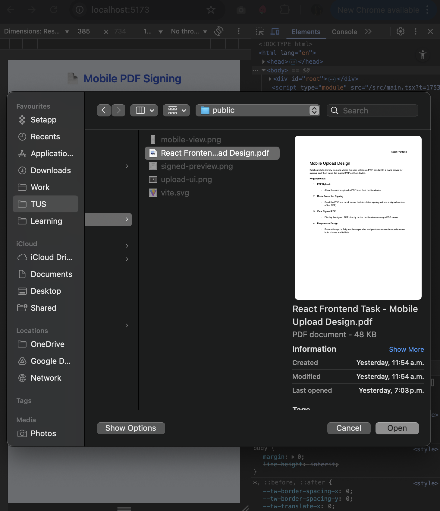
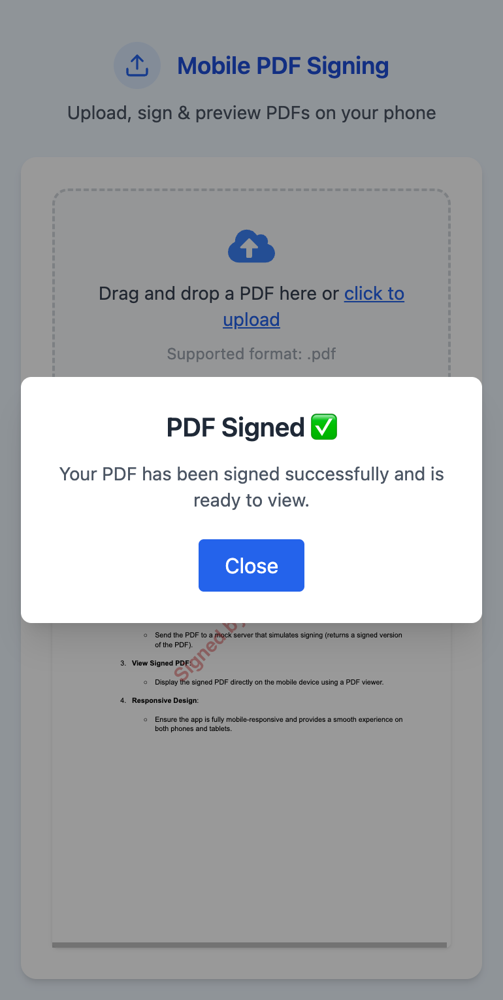
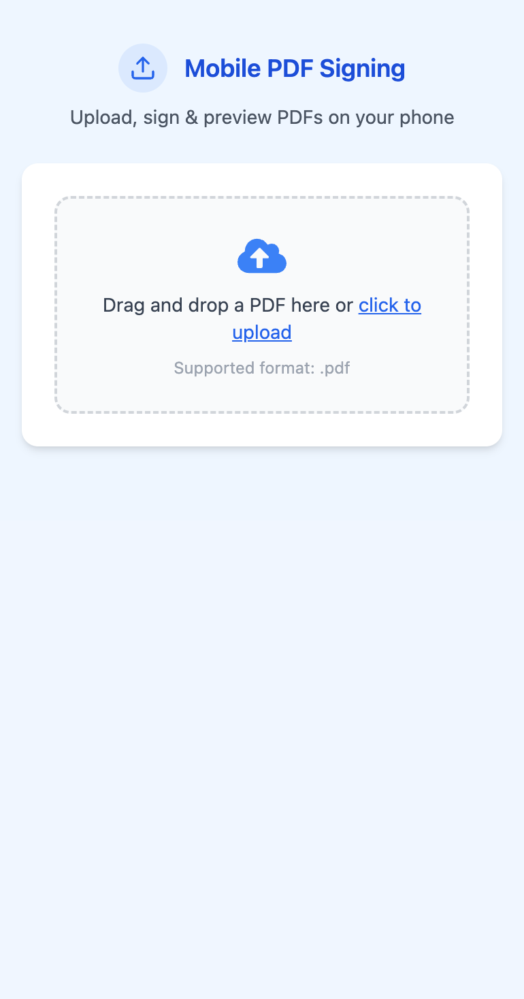
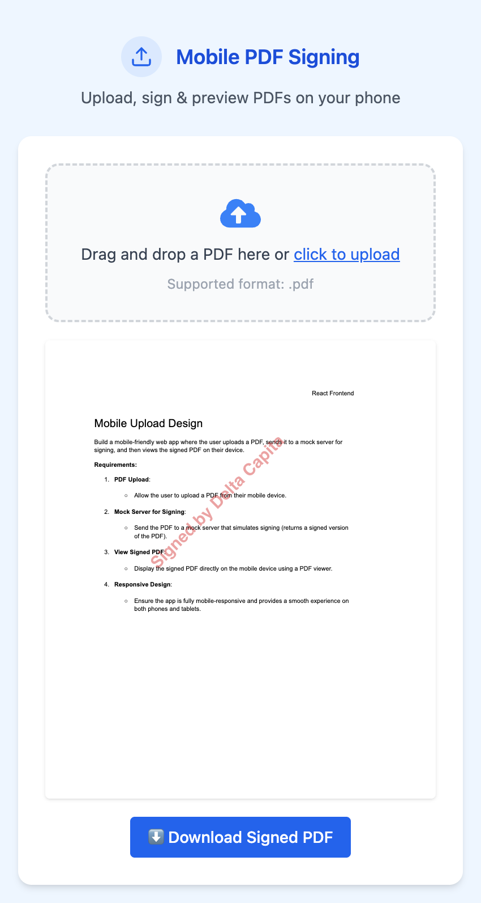

Here is your **updated and corrected README.md**, including the **fixed Final UI Highlights table** with 4 images and proper headings, and overall polished formatting:

---

# 📄 Mobile PDF Signing App

A mobile-friendly web application that allows users to **upload a PDF**, send it to a mock server for simulated signing (with a visible watermark), and instantly **preview or download the signed PDF**.
Built with a focus on responsive UX, clean design, and smooth feedback.

---

## ✅ Features

* 📤 Drag-and-drop or click-to-upload PDF files
* 🔐 Server simulates signing by embedding a visible watermark: `Signed by Delta Capita`
* 👀 Preview signed PDF using `react-pdf`
* ✅ Toast and dialog for success/error feedback
* 📱 Mobile-first, responsive UI (Tailwind CSS)

---

## 🖼️ Final UI Highlights

| 📥 Upload UI                             | ✅ Success Toast + Dialog                      | 🔍 Signed PDF Preview                    | 🖋️ Watermarked PDF                            |
| ---------------------------------------- | --------------------------------------------- | ---------------------------------------- | ---------------------------------------------- |
|  |  |  |  |

---

## 📦 Tech Stack

| Layer       | Technology                          |
| ----------- | ----------------------------------- |
| Frontend    | React, TypeScript, Tailwind CSS     |
| PDF Viewer  | `react-pdf`, `pdfjs-dist`           |
| Backend     | Node.js, Express, Multer, `pdf-lib` |
| Dev Tooling | Vite, ts-node, ESLint               |

---

## 🧱 Project Structure

```
mobile-pdf-upload/
├── public/
│   ├── upload-pdf-ui.png
│   ├── signed-preview.png
│   ├── mobile-view.png
│   └── success-upload.png
├── src/
│   ├── components/
│   │   ├── PdfUpload.tsx      # Upload drag/drop UI
│   │   ├── PdfViewer.tsx      # Render signed PDF
│   │   ├── Toast.tsx          # Feedback toast component
│   │   └── Dialog.tsx         # Popup dialog component
│   ├── services/
│   │   └── api.ts             # Upload logic
│   ├── App.tsx                # Main app state + flow
│   └── index.css              # Tailwind setup
├── server/
│   └── mock-server.ts         # Express + pdf-lib watermarking
├── README.md
├── vite.config.ts
├── tailwind.config.js
├── tsconfig.json
```

---

## 🚀 Getting Started

### 1. Run the Frontend

```bash
npm install
npm run dev
```

> App runs at: `http://localhost:5173`

---

### 2. Start the Mock Signing Server

```bash
cd server
npx ts-node mock-server.ts
```

> Server endpoint: `POST http://localhost:3001/sign-pdf`

---

## 🧪 Flow Overview

1. User uploads a `.pdf`
2. Frontend sends it to `/sign-pdf`
3. Server adds watermark text to every page
4. The signed PDF is streamed back
5. User can preview/download it

---

## 🖋️ Watermarking Details

* ✅ Added using `pdf-lib`
* Properties:

  * Text: `"Signed by Delta Capita"`
  * Font: `HelveticaBold`
  * Color: Gray
  * Opacity: `0.4`
  * Rotation: `45°`
  * Position: Center-bottom

---

## 📱 Mobile-First Design

* Built using Tailwind’s utility classes like `max-w-md`, `text-center`, and responsive padding
* Optimized for phones, tablets, and desktops

---

## ⚠️ Notes

* This is a **mock simulation** — no actual cryptographic signatures
* Great for demonstrating frontend-to-backend PDF workflows

---

## 👨‍💻 Author

Built by **\[Kajal Singh]** for the **Delta Capita – Frontend Engineer Assessment**.

